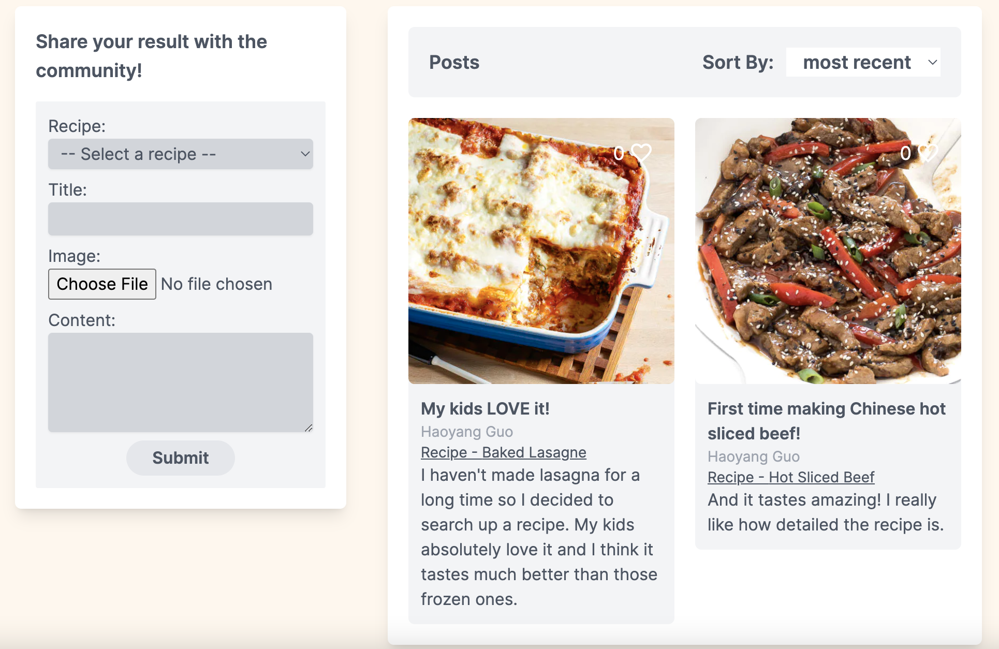

## Recipe Space
Recipe Space is a fully responsive web application that allows you to search for recipes based on your list of ingredients. It is also an online community where people can share what they made using our recipes.

## Live Demo
[recipe-space.dhguo.dev](recipe-space.dhguo.dev)

## Technologies
Next.js (w/ API Routes), React.js, Prisma, React-Query, Jotai, React-Hook-Form, TailwindCSS. 

## Screen Shots

Recipe Space allows you to search by either ingredients in the recipes or by common names of the recipes.

It's also a platform to showcase delicious dishes you've made with our recipe!

Powered by [Spoonacular's API](https://spoonacular.com/food-api/),
our recipes are carefully selected from all cuisines.

